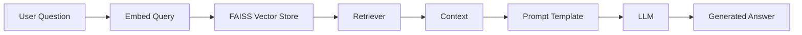

# 🎬 Anime Recommendation System — RAG with LangChain


A **semantic anime recommendation engine** built with **LangChain**, **Retrieval-Augmented Generation (RAG)** and a **local Hugging Face LLM**.

The system recommends anime titles based on **meaning**, not exact keywords.

---

## 📑 Table of Contents
- [🧠 Overview](#-overview)
- [🎯 Project Objectives](#-project-objectives)
- [🧠 System Overview](#-system-overview)
- [📂 Dataset](#-dataset)
- [🏗️ Project Architecture](#️-project-architecture)
- [🧹 Data Preprocessing](#-data-preprocessing)
- [🧠 Semantic Representation & Retrieval](#-semantic-representation--retrieval)
  - [✂️ Text Splitting](#️-text-splitting)
  - [🔢 Embeddings](#-embeddings)
  - [🗂️ Vector Store — FAISS](#️-vector-store--faiss)
  - [🔍 Semantic Search (Retrieval)](#-semantic-search-retrieval)
- [🤖 Large Language Model (LLM)](#-large-language-model-llm)
- [✍️ Prompt Engineering](#️-prompt-engineering)
- [🔗 RAG Pipeline (LCEL)](#-rag-pipeline-lcel)
- [🧪 Example Usage](#-example-usage)
- [📌 Key Takeaways](#-key-takeaways)
- [🔮 Next Steps](#-next-steps)
- [🛠️ Tools & Libraries](#️-tools--libraries)
- [📦 Requirements](#-requirements)
- [🧾 Author](#-author)

---

## 🧠 Overview

This project demonstrates how to build a **semantic anime recommendation system** using **Retrieval-Augmented Generation (RAG)** with LangChain.

Traditional recommendation systems rely on keywords or known titles. This project answers a different question:

> **How can we recommend anime when users only describe the type of story they want?**

Unlike traditional recommendation systems based on exact titles or keywords, this system understands **user intent expressed in natural language**, such as:

> *"anime d'action avec des animaux"*

The system retrieves the most semantically relevant anime descriptions and generates a **natural-language recommendation** using a Large Language Model (LLM).

### Key capabilities:
- Semantic understanding of vague user queries
- Vector-based similarity search
- Controlled text generation grounded in retrieved data

---

## 🎯 Project Objectives

User queries are often:
- vague
- subjective
- meaning-based rather than keyword-based

This project demonstrates how **RAG (Retrieval-Augmented Generation)** solves this problem by combining:
- semantic search
- document retrieval
- controlled text generation

It does: 

- Understand the meaning of user queries (not keywords)
- Search a database of anime descriptions semantically
- Generate accurate, grounded recommendations
- Avoid hallucinations by constraining the LLM with context

---

## 🧠 System Overview


---

## 📂 Dataset

The dataset is a CSV file containing anime metadata.

### Original columns:
- `Name` — Anime title
- `sypnopsis` — Plot summary
- `Genres` — Genre labels

These fields are merged into a single textual description to improve semantic understanding.

Example:
```
Title: Naruto.
Overview: A young ninja striving to be the strongest.
Genres: Action, Adventure, Shounen
```

This format improves semantic understanding by embedding models.


---

## 🏗️ Project Architecture


```
User Query
   ↓
Embedding Model
   ↓
FAISS Vector Store
   ↓
Retriever → {context}
   ↓
PromptTemplate
   ↓
LLM (Flan-T5)
   ↓
Recommendation Output
```


---

## 🧹 Data Preprocessing

Steps:
- Load CSV data
- Merge columns into a single textual field
- Convert rows into LangChain `Document` objects
- Split documents into overlapping chunks

Why?
- Improves embedding quality
- Preserves narrative context
- Avoids token limits

---

## 🧠 Semantic Representation & Retrieval

This stage transforms raw text into a searchable semantic memory that enables **meaning-based retrieval**, which is the foundation of the RAG pipeline.

---

### ✂️ Text Splitting

Long anime descriptions are split into **overlapping text chunks** in order to:

- Respect embedding model input limits  
- Preserve semantic coherence across chunks  
- Improve retrieval precision  

**Method used:** `RecursiveCharacterTextSplitter`

This ensures that each chunk remains meaningful while still fitting the constraints of the embedding model.

---

### 🔢 Embeddings

Each text chunk is converted into a **dense vector representation** using:

- **Model:** `sentence-transformers/all-MiniLM-L6-v2`

Embeddings map text into a numerical space where **semantic similarity** can be measured mathematically rather than via exact word matching.

**Semantic similarity example:**

> *"anime d'action avec des animaux"*  
≈  
> *"aventures de créatures combattantes"*

---

### 🗂️ Vector Store — FAISS

The embedding vectors are stored in **FAISS (Facebook AI Similarity Search)**.

FAISS acts as the system’s **semantic memory**:

- Stores dense vectors efficiently  
- Enables fast semantic similarity search  
- Supports approximate nearest-neighbor retrieval  

---

### 🔍 Semantic Search (Retrieval)

When a user submits a query:

1. The query is embedded using the same embedding model  
2. Its vector is compared against the stored vectors  
3. The most semantically similar documents are retrieved  

This retrieval step happens **before any text generation** and provides the factual grounding used later by the LLM.

---

## 🤖 Large Language Model (LLM)

### Model:
- **FLAN-T5 (Google)**

### Role:
- Generate human-readable recommendations
- Follow strict instructions
- Use *only* the retrieved context

The LLM does not know anything about LangChain or FAISS — it only sees the final prompt.

---

## ✍️ Prompt Engineering

The prompt defines:
- the role of the model (anime expert)
- the allowed information (retrieved context)
- the response structure


Example:
```
You are an anime recommendation expert.
Use only the following context:

{context}

Question: {question}
Response:
```

Key rule:
> **The LLM never sees LangChain — only the final prompt text.**

---

## 🔗 RAG Pipeline (LCEL)

LangChain Expression Language (LCEL) allows an explicit and debuggable pipeline:

```
{
  "context": retriever,
  "question": RunnablePassthrough()
}
| PromptTemplate
| LLM
| OutputParser
```

Execution logic:
- the question is duplicated
- documents become `{context}`
- the question remains `{question}`
- the prompt is filled at runtime

---

## 🧪 Example Usage

```python
query = "anime d'action avec de la science-fiction"
response = rag_chain.invoke(query)
print(response)
```

The system returns:
- recommended anime titles
- short plot explanations
- justification based on genres and themes grounded in retrieved documents

---

## 📌 Key Takeaways

- Semantic search outperforms keyword search for vague queries
- RAG reduces hallucinations by constraining the LLM
- PromptTemplate is evaluated **at runtime**
- LCEL makes the pipeline transparent and explainable

---

## 🔮 Next Steps

- Add user personalization (profiles with age, preferences)
- Use larger instruction-tuned LLMs
- Deploy as a REST API (FastAPI)
- Add a web interface for recommendations

---

## 🛠️ Tools & Libraries

- Python
- LangChain (LCEL)
- Hugging Face Transformers
- Sentence Transformers
- FAISS
- Pandas

---

## 📦 Requirements

This project requires Python **3.9+** and the following dependencies.

### Installation

```bash
pip install -r requirements.txt
```

### Main dependencies

- langchain
- langchain-community
- langchain-core
- langchain-huggingface
- transformers
- sentence-transformers
- faiss-cpu
- pandas
- numpy

---

## 🧾 Author

**Alexandra Boudia**  
Data Scientist | Generative AI & NLP  
